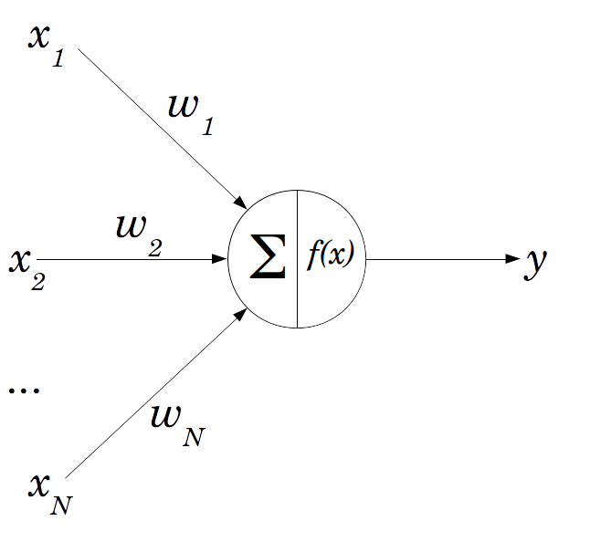

# Visualization-of-MLP-backpropagation-with-XOR
XOR, AND, OR 논리연산 학습을 통한 MLP 인공신경망(Multilayer perceptron neural network)의 오차 역전파(Backpropagation) 시각화


**구현 영상**

[](http://www.youtube.com/watch?v=hMpV4omemxc)


## 0. 그대로 실행 시 주의사항
그대로 실행 시, 하위 디렉토리 ```\datas``` 에 학습 내용에 대해 모두 저장하도록 되어 있습니다.
수많은 파일을 생성하고 싶지 않다면, ```Program.cs``` 에서 ```Program```클래스의 ```Main()``` 함수를 수정하세요.

## 1. MLP와 역전파(Backpropagation)
**퍼셉트론(Perceptron)**



 신경 세포인 뉴런이 활성화 되는 과정을 가중치, 활성 함수 등의 인공적(계산적) 방법을 활용하여 구현한 인공뉴런.

**MLP (Multilayer Perceptron - 다중 층 퍼셉트론) 신경망**

 여러 퍼셉트론(perceptron)을 이용해 구현한 피드포워드(feedforward) 인공신경망. 단일 층 퍼셉트론이 비선형적(non-linear) 분류를 하지 못한다는 한계 극복 가능

**역전파(Backpropagation, 오차 역전파) 알고리즘**

 미분의 연쇄법칙(chain rule)을 통해 각 가중치에 대한 손실 함수(Loss function)의 기울기를 구하고 오차를 줄이는 방향으로 수정해 나가는 알고리즘
 
## 2. MLP 인공신경망과 논리연산(XOR, AND, OR)


**AND 연산, OR 연산의 분류**
 


 
 선형적 분류 가능 → 단일 층 퍼셉트론 학습 가능
 
**XOR 연산의 분류**
 


 비선형적 분류 필요 → 다중 층 퍼셉트론 학습 필요
 
## 3. 학습과정 시각화 방법
**실수 색 부호화**

 (출력값)×255를 RGB값으로 가지도록 색 부호화


**입력 값/출력 값 표현**


**1)** 두 축을 각각의 입력 변수 축으로 표현

**2)** (입력 값 1, 입력 값 2) 좌표에 출력값의 색 부호를 출력

**3)** 출력값이 0.5 이상 0.51 미만일 경우 붉은 색으로 표현


